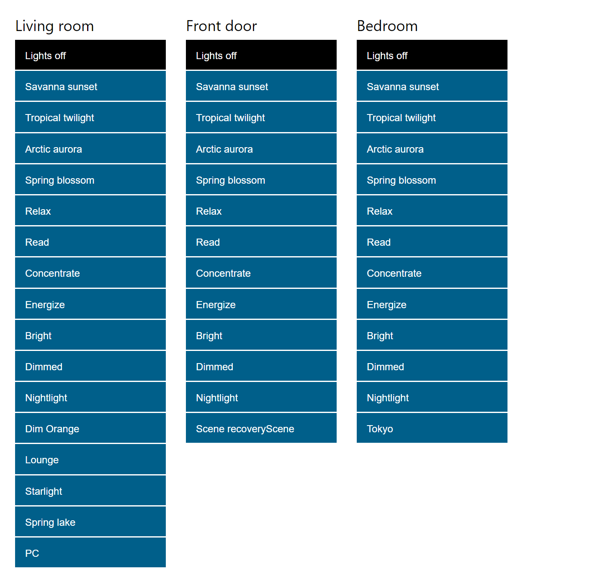

# WebHue

WebHue allows to set room scenes from any device in your network.
It uses existing scenes from your Hue Bridge that can be defined using the Hue apps.

## Screenshot

## Getting Started
You need to get an API key from your Hue Bridge and setup the server in order to use WebHue.

### Hue Bridge API Key
First, find out the local IP of your Hue Bridge, e.g., by checking on your router interface. Access the debug terminal in your browser: `http://<HUE_BRIDGE_IP>/debug/clip.html`. Enter the URL `/api/` and the message body `{"devicetype":"webhue"}`. Press the button on your Hue Bridge and press the POST-button on the webpage. Save the received key.

### Server Setup
1. Set your Hue Bridge IP and KEY in `config.py`
2. Install Python 3
3. Install libraries `pip install -r requirements.txt`
4. Start the server: `python start.py`
5. Open the website: `http://<ip>:8080`
